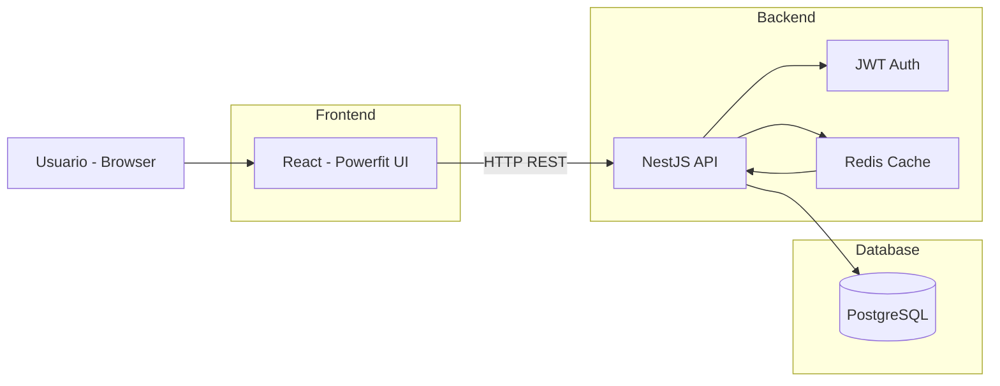

# 🛒 Powerfit Suplementos — Plataforma de E‑commerce

Plataforma completa de **e‑commerce para suplementos**, construída com **arquitetura moderna em containers**, separando **Frontend** e **Backend** e utilizando **cache, autenticação JWT e banco relacional**.

> Projeto acadêmico/desenvolvimento prático utilizando **React**, **NestJS**, **PostgreSQL**, **Redis** e **Docker**.

**Autores:** Samara Araújo & Adriel Gomes

---

## 🧱 Visão Geral da Arquitetura

* Arquitetura **Frontend + API REST**
* Backend modular com **NestJS**
* **Redis** para cache de alto desempenho
* **PostgreSQL** para persistência de dados
* Autenticação baseada em **JWT**
* Orquestração via **Docker Compose**

---

## 🛠️ Tecnologias Utilizadas

### 🔧 Backend — `loja_api`

| Tecnologia     | Descrição                                          |
| -------------- | -------------------------------------------------- |
| **NestJS**     | Framework Node.js para APIs escaláveis e modulares |
| **TypeORM**    | ORM para mapeamento objeto‑relacional              |
| **TypeScript** | Tipagem forte e melhor manutenção                  |
| **PostgreSQL** | Banco de dados relacional                          |
| **Redis**      | Cache em memória (produtos, carrinho, etc.)        |
| **JWT**        | Autenticação e autorização (Admin / Cliente)       |
| **Docker**     | Containerização do backend                         |

### 🎨 Frontend — `frontend`

| Tecnologia           | Descrição                              |
| -------------------- | -------------------------------------- |
| **React**            | Interface do usuário                   |
| **Vite**             | Build e desenvolvimento                |
| **Axios**            | Comunicação com a API                  |
| **React Router DOM** | Roteamento                             |
| **CSS puro**         | Estilização responsiva (preto/amarelo) |

### 📦 Infraestrutura

* **Docker**
* **Docker Compose**

---

## 🚀 Como Executar o Projeto

### ✔️ Pré‑requisitos

* Docker
* Docker Compose

---

### 1️⃣ Clonar o Repositório

```bash
git clone https://github.com/s4mnara/Ecommerce-nestjs.git
cd Ecommerce-nestjs
```

---

### 2️⃣ Configurar Variáveis de Ambiente

Crie um arquivo `.env` (backend):

```env
DB_HOST=loja_db
DB_PORT=5432
DB_USERNAME=postgres
DB_PASSWORD=postgres
DB_DATABASE=loja_db

JWT_SECRET=sua_chave_secreta

REDIS_HOST=loja_redis
REDIS_PORT=6379
```

---

### 3️⃣ Subir os Containers

```bash
docker-compose up --build
```

⚠️ **Erro ENOMEM (NestJS)**

Caso o container `loja_api` falhe, aumente a memória do Docker Desktop:

> Settings → Resources → Memory → **mínimo 4GB**

---

### 4️⃣ Acessar a Aplicação

* **Frontend (Cliente / Admin)**
  👉 [http://localhost:3000/login](http://localhost:3000/login)

* **API Backend**
  👉 [http://localhost:8080](http://localhost:8080)

---

## 📦 Funcionalidades

### 🔐 Autenticação

* Registro e login de usuários
* JWT com controle de papéis
* Perfis: `admin` e `cliente`

---

### 🧑‍💼 Painel Administrativo — `/dashboard`

Acesso restrito a **admins**:

* CRUD completo de produtos
* Upload de imagens
* Visualização de clientes
* Pesquisa global
* Logs de usuários

---

### 🛍️ Área do Cliente — `/client`

* Listagem de produtos
* Carrinho de compras
* Alteração de quantidades
* Finalização de pedidos
* Histórico de pedidos

---

## ⚡ Cache e Performance (Redis)

Chaves utilizadas:

* `produtos:all`
* `produtos:{id}`
* `carrinho:{usuarioId}`

Invalidação automática em operações de **create / update / delete**.

Visualizar chaves:

```bash
docker exec -it loja_redis redis-cli
keys *
```

---

## 🎨 Identidade Visual

* Tema: **Powerfit Suplementos**
* Cores: **Preto e Amarelo**
* Estilo: **Minimalista e focado em conversão**

---

## Arquitetura em Camadas (Layered Architecture) com Cache-Aside Pattern

* Frontend desacoplado
* API REST centralizadora
* Cache Redis controlado pela aplicação
* Banco relacional como fonte de verdade
* Autenticação JWT integrada à API



---

## ⚙️ CI/CD Full‑Stack

Este projeto possui **pipeline de CI/CD** configurado com **GitHub Actions**, garantindo que **backend e frontend** sejam testados e buildados automaticamente a cada **push** ou **pull request** nas branches `main` ou `develop`.

### 🔹 Funcionalidades do CI/CD

1. **Backend NestJS (`loja_api`)**
   - Instala dependências
   - Roda testes unitários (`npm test`)
   - Builda a aplicação (`npm run build`)
   - Gera a imagem Docker (`loja_api`)

2. **Frontend React (`frontend`)**
   - Instala dependências
   - Roda testes (`npm test`)
   - Builda o projeto (`npm run build`)
   - Gera a imagem Docker (`loja_frontend`)

3. **Serviços de suporte**
   - PostgreSQL para testes do backend
   - Redis para cache e testes de performance

### 🔹 Como visualizar o CI/CD

O workflow está definido em:

```

.github/workflows/ci.yml

```

Exemplo de execução no GitHub Actions:


> Cada push ou pull request dispara automaticamente a pipeline, garantindo que **qualquer alteração no backend ou frontend seja validada antes de ir para produção**.


---


## 👩‍💻 Autores

* **Samara Araújo**
* **Adriel Gomes**

---

⭐ Se este projeto te ajudou, deixe uma estrela no repositório!

